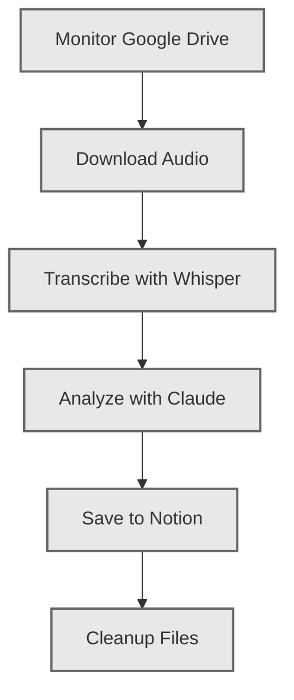

# Audio to Notion Pipeline - DAG Architecture

This document explains the DAG (Directed Acyclic Graph) structure of the audio processing pipeline.

## What is a DAG?

A DAG is a directed graph with no cycles, perfect for representing workflows where:
- Tasks have dependencies (must run in order)
- Parallel execution is possible (where no dependencies exist)
- Each task runs once per execution
- Failures can be tracked and visualized

## Pipeline Structure

### Task Flow



### Task Details

#### 1. Monitor Google Drive
- **Dependencies**: None (entry point)
- **Purpose**: Check for new audio files
- **Output**: File metadata (ID, name, size, modified time)
- **Location**: `tasks/monitor_task.py`

#### 2. Download Audio
- **Dependencies**: Monitor Google Drive
- **Purpose**: Download audio file to temp directory
- **Output**: Local file path
- **Location**: `tasks/download_task.py`

#### 3. Transcribe with Whisper
- **Dependencies**: Download Audio
- **Purpose**: Convert audio to text using Whisper AI
- **Output**: Full transcript, duration, language
- **Location**: `tasks/transcribe_task.py`

#### 4. Hand Off to Intelligence Service
- **Dependencies**: Transcribe with Whisper
- **Purpose**: Save transcript to Supabase and invoke `/api/v1/process/{transcript_id}` on
  `jarvis-intelligence-service`
- **Output**: Structured analysis returned by the intelligence service (meetings,
  journals, reflections, tasks, CRM updates) plus the database IDs created by that service
- **Location**: `tasks/analyze_task_multi.py`
- **Special Features**:
  - **Multiple entries per file**: Intelligence service can create several meetings,
    reflections, journals, and tasks from one transcript
  - **Centralized CRM matching**: Name resolution and topic routing live entirely in the
    intelligence service so every client reuses the same logic

#### 5. Save to Notion
- **Dependencies**: Analyze with Claude
- **Purpose**: Create database entry with all processed data
- **Output**: Notion page ID and URL
- **Location**: `tasks/notion_task.py`

#### 6. Cleanup Files
- **Dependencies**: Save to Notion
- **Purpose**: Delete temporary audio file
- **Output**: Cleanup success status
- **Location**: `tasks/cleanup_task.py`

## Project Structure

```
audio-to-notion/
├── main_dag.py              # DAG-based main orchestrator
├── visualize_pipeline.py    # Visualization generator
│
├── dag/                      # DAG framework
│   ├── framework.py         # Core DAG engine
│   └── pipeline_dag.py      # Pipeline definition
│
├── tasks/                    # Individual task modules
│   ├── __init__.py          # Task exports
│   ├── monitor_task.py      # Google Drive monitoring
│   ├── download_task.py     # File download
│   ├── transcribe_task.py   # Whisper transcription
│   ├── analyze_task.py      # Claude analysis
│   ├── notion_task.py       # Notion integration
│   └── cleanup_task.py      # File cleanup
│
├── visualization/            # Visualization utilities
│   └── dag_viz.py           # Mermaid, HTML, ASCII export
│
├── [Original modules]
├── gdrive_monitor.py        # Google Drive API client
├── transcriber.py           # Whisper wrapper
├── llm_analyzer.py          # Claude API client
├── notion_client.py         # Notion API client
├── utils.py                 # Helper functions
└── config.py                # Configuration
```

## Benefits of DAG Architecture

### 1. **Modularity**
Each task is isolated in its own file with clear inputs/outputs:
```python
def task_name(context: Dict[str, Any]) -> Dict[str, Any]:
    # Get inputs from previous tasks
    input_data = context['task_results']['previous_task']
    
    # Process
    result = do_work(input_data)
    
    # Return output
    return {'output_key': result}
```

### 2. **Visualization**
Generate diagrams showing:
- Task dependencies
- Execution order
- Status of each task
- Duration and performance

### 3. **Error Handling**
- Failed tasks don't crash entire pipeline
- Dependent tasks are automatically skipped
- Easy to see where failures occur
- Can retry specific tasks

### 4. **Extensibility**
Add new tasks easily:
```python
# 1. Create task function in tasks/new_task.py
def my_new_task(context):
    return {'result': 'data'}

# 2. Add to DAG in dag/pipeline_dag.py
new_task = Task(
    task_id="my_new_task",
    name="My New Task",
    execute_fn=my_new_task,
    dependencies=["previous_task"],
    description="What this task does"
)
dag.add_task(new_task)
```

### 5. **Testing**
Test individual tasks in isolation:
```python
from tasks.transcribe_task import transcribe_audio

context = {
    'task_results': {
        'download_audio_file': {
            'audio_path': Path('test.mp3')
        }
    }
}

result = transcribe_audio(context)
print(result['transcript'])
```

## Usage

### Run with DAG (recommended)
```powershell
# Process one file with visualization
python main_dag.py --once --visualize

# Run continuously
python main_dag.py

# Show DAG structure without processing
python main_dag.py --summary
```

### Generate Visualizations
```powershell
# Create interactive HTML and Mermaid diagrams
python visualize_pipeline.py
```

This will create:
- `visualizations/pipeline_structure.html` - Interactive HTML
- `visualizations/pipeline_diagram.md` - Mermaid markdown

### Run Original (non-DAG)
```powershell
python main.py
```

## Visualization Examples

### ASCII Diagram (Console)
```
DAG: audio_to_notion_pipeline
Description: Complete pipeline: Google Drive → Whisper → Claude → Notion
============================================================

· Monitor Google Drive
  |
· Download Audio
  ↳ Depends on: Monitor Google Drive
  |
· Transcribe with Whisper
  ↳ Depends on: Download Audio
  |
· Analyze with Claude
  ↳ Depends on: Transcribe with Whisper
  |
· Save to Notion
  ↳ Depends on: Analyze with Claude
  |
· Cleanup Files
  ↳ Depends on: Save to Notion

============================================================
Summary:
  Total tasks: 6
  pending: 6
```

### Status Indicators
- `✓` = Success
- `✗` = Failed
- `→` = Running
- `○` = Skipped
- `·` = Pending

## Advanced Features

### Custom DAGs
Create specialized pipelines:
```python
# Test DAG (monitor only)
from dag.pipeline_dag import create_simple_test_dag
dag = create_simple_test_dag()

# Custom DAG with parallel tasks
dag = DAG("custom_pipeline", "Custom workflow")
# Add tasks with same dependencies to run in parallel
```

### Execution History
Track all runs:
```python
pipeline = AudioProcessingPipeline()
pipeline.run_once()

# View history
summary = pipeline.dag.get_summary()
print(summary['execution_history'])
```

### Performance Monitoring
Each task tracks:
- Start time
- End time
- Duration
- Status
- Errors (if any)

## Migration from Old Main

| Old `main.py` | New DAG Version |
|--------------|-----------------|
| Single large class | Modular task functions |
| Hard-coded flow | Configurable DAG |
| Linear execution | Dependency-based |
| No visualization | Multiple viz formats |
| Difficult to test | Easy unit testing |

## Next Steps

1. **Add parallel tasks**: Transcribe + analyze in parallel if possible
2. **Speaker diarization**: Add as separate task after transcription
3. **Retry logic**: Add automatic retries for failed tasks
4. **Monitoring**: Add metrics and alerting tasks
5. **Scheduling**: Integrate with cron or task scheduler

---

**Note**: Both `main.py` (original) and `main_dag.py` (DAG-based) are functional. Use DAG version for better structure and visualization.
